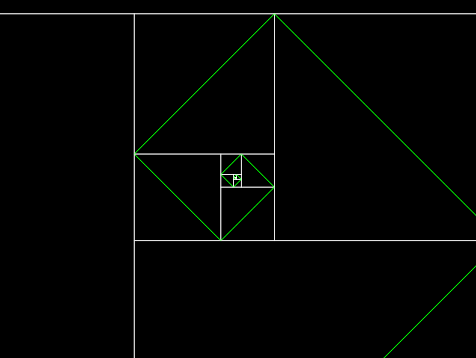

# Fibonacci Spiral

The Fibonacci Sequence is the series of numbers where the next number is found by adding up the two previous numbers. When we draw squares with the fibonacci numbers representing their width, we get a nice spiral(it's not really a spiral now, but I will fix that eventually when I learn how to draw spirals 😅)

## Run

First clone the repo

`git clone https://github.com/yanbentes/fibonacci-spiral.git`

then run love

`love fibonacci-spiral/ `
